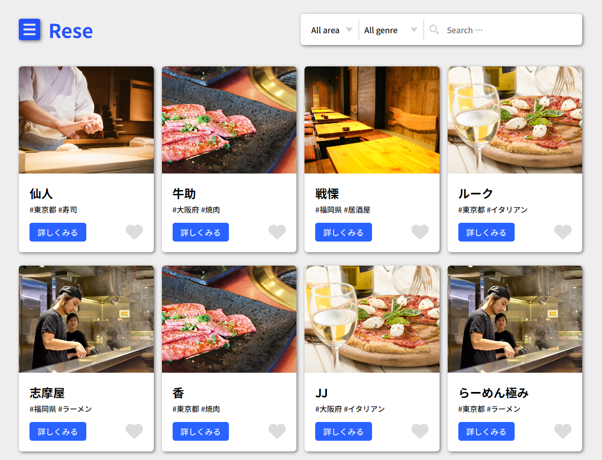
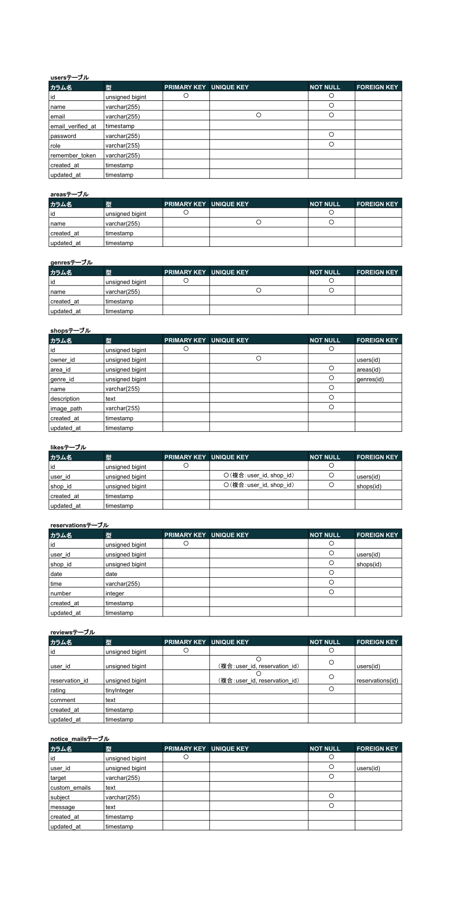
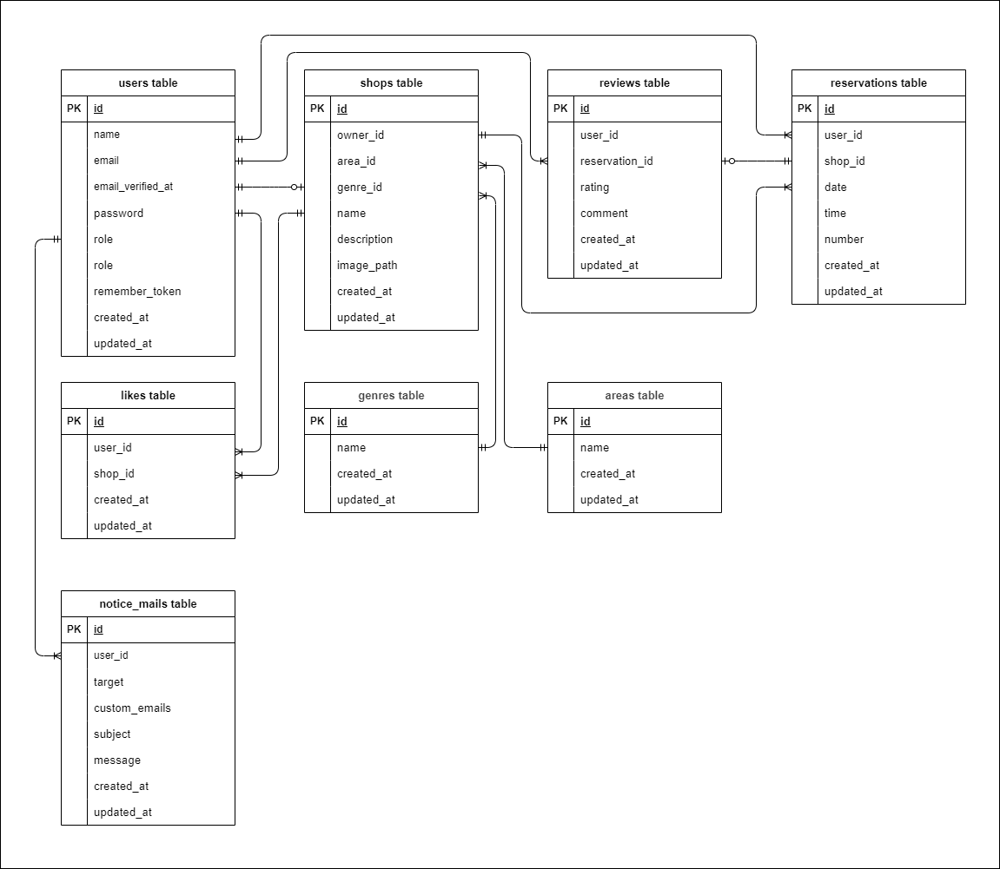

# Rese（リーズ）  

## 概要説明  
Reseは、飲食店の検索・予約・レビューができるWebアプリケーションです。  
ユーザーは飲食店の検索・予約・来店後にレビューを投稿できます。  
管理者は店舗代表者の作成・お知らせメールの送信ができます。  
店舗代表者は店舗情報の更新・予約確認・お知らせメール送信も行えます。  


## 作成の目的  
既存の飲食店予約サービスは手数料が高く、自社グループの店舗向けに手数料のかからない予約管理システムを構築したいという背景から、本アプリを開発しました。  
初年度ユーザー数10,000人を目指し、シンプルで使いやすい予約体験を提供することを目的としています。

## アプリケーションURL

### 🔹 開発環境（ローカル）
- URL：[http://localhost/](http://localhost/)
- 対象：ローカル開発用（Docker利用を前提）
- 一般ユーザー用ログインURL：[http://localhost/login](http://localhost/login)
- 管理者用ログインURL：[http://localhost/admin/login](http://localhost/admin/login)
- 店舗代表者用ログインURL：[http://localhost/owner/login](http://localhost/owner/login)
- ログインアカウント：サンプルユーザーでログイン可能（詳細はREADME内「サンプルアカウント」参照）
- メール確認ツール（MailHog）：[http://localhost:8025](http://localhost:8025)
- DB操作ツール（phpMyAdmin）：[http://localhost:8080](http://localhost:8080)

### 🔹 本番環境（AWS EC2）
- URL：[http://13.211.219.123/](http://13.211.219.123/)
- 対象：公開デモ・動作確認用
- 一般ユーザー用ログインURL：[http://13.211.219.123/login](http://13.211.219.123/login)
- 管理者用ログインURL：[http://13.211.219.123/admin/login](http://13.211.219.123/admin/login)
- 店舗代表者用ログインURL：[http://13.211.219.123/owner/login](http://13.211.219.123/owner/login)
- ログインアカウント：サンプルユーザーでログイン可能（詳細はREADME内「サンプルアカウント」参照）
- メール機能：実際の送信は行わず、ログ出力で内容を確認

## 他のリポジトリ  
※本アプリはフロントエンドとバックエンドが統合された構成のため、リポジトリは1つのみです。  
- GitHub: https://github.com/mmisa33/rese

## 機能一覧

### 🔹 一般ユーザー向け機能
- 会員登録
- メール認証機能（実際のメール送信は行わないため、開発環境の一般ユーザーのみ使用）
- ログイン・ログアウト
- ユーザー情報取得
- 飲食店一覧・詳細の閲覧
- 店舗のエリア・ジャンル・店名による検索
- お気に入り飲食店追加・削除・一覧取得
- 飲食店予約の追加・キャンセル・変更
- 来店済み店舗への評価（5段階評価＋コメント）
- QRコード表示（来店時に店舗側に提示）
- Stripe決済（事前決済・前払い）

### 🔹 店舗代表者向け機能
- ログイン・ログアウト
- 管理画面アクセス
- 自店舗情報の作成・編集
- 予約情報の一覧確認
- 予約情報の日付範囲指定・来店状況・予約者名による検索
- お知らせメール送信

### 🔹 管理者向け機能
- ログイン・ログアウト
- 管理画面アクセス
- 店舗代表者アカウントの作成・管理
- お知らせメール送信

### 🔹 共通・全体機能
- バリデーション（FormRequestによる入力チェック）
- レスポンシブデザイン（1400〜1540pxおよび768px〜850pxのブレイクポイントに対応）
- 画像ストレージ対応（AWS S3利用）  
※ローカル開発環境では `storage/app/public` に保存し、S3では本番環境での画像アップロード・表示に対応
- リマインダー通知（予約当日の朝にタスクスケジューラーで送信）
- 環境の切り分け（開発環境と本番環境の分離）
- AWSインフラ（S3・EC2・RDSの利用）

## 使用技術（実行環境）  
### 🔹 共通
- **言語／フレームワーク**: PHP / Laravel  
※開発環境と本番環境でPHPバージョンが異なります（下記参照）
- **開発環境構築**: Docker
- **バージョン管理**: GitHub
- **インフラ**: AWS（EC2、RDS、S3）

### 🔹 開発環境（ローカル）
- **OS**: Ubuntu（Dockerコンテナ内で稼働）
- **PHPバージョン**: 7.4.9
- **Laravelバージョン**: 8.83.8
- **データベース**: MariaDB 10.3.39
- **メール送信**: MailHog（http://localhost:8025）でメール内容をブラウザ確認
- **画像保存先**: `storage/app/public`

### 🔹 本番環境（AWS EC2）
- **OS**: Amazon Linux 2
- **PHPバージョン**: 8.1.31
- **Laravelバージョン**: 8.83.8
- **データベース**: MySQL 8.0.41（RDS）
- **メール送信**: 実際の送信は行わず、ログファイル（`storage/logs/laravel.log`）に記録
- **画像保存先**: AWS S3（アップロード・表示に対応）

### 🔹 その他使用技術
- Laravel Fortify（認証）
- Stripe（事前決済）
- Simple QrCode（予約確認用QRコード表示）
- Laravel Schedule（予約リマインダーメールの自動送信）

## テーブル設計


## ER図



## 環境構築

### 🔹 ローカル開発環境（Docker利用）

1. リポジトリをクローン
   ```bash
   git clone git@github.com:mmisa33/rese.git
   ```
2. プロジェクトフォルダに移動
    ```bash
    cd rese
    ```
3. Dockerコンテナをビルドして起動
    ```bash
    docker-compose up -d --build
    ```
    > **⚠ 注意**  
    > MySQLは環境によって起動しない場合があります。必要に応じて docker-compose.yml を編集してください。
4. PHPコンテナに入る
   ```bash
    docker-compose exec php bash
    ```
5. 必要な依存パッケージをインストール
    ```bash
    composer install
    ```
6. 環境変数ファイルを作成
    ```bash
    cp .env.example .env
    ```
7. .env を編集（開発用例）
    ```bash
    # アプリ設定
    APP_NAME=Rese
    APP_ENV=local
    APP_KEY=base64:XXXXXXXXXXXXXXXXX （※ key:generate 実行後に自動入力されます）
    APP_DEBUG=true
    APP_URL=http://localhost

    # データベース設定
    DB_CONNECTION=mysql
    DB_HOST=mysql
    DB_PORT=3306
    DB_DATABASE=laravel_db
    DB_USERNAME=laravel_user
    DB_PASSWORD=laravel_pass

    # MailHog設定（開発用メール確認ツール）
    MAIL_MAILER=smtp
    MAIL_HOST=mailhog
    MAIL_PORT=1025
    MAIL_USERNAME=null
    MAIL_PASSWORD=null
    MAIL_ENCRYPTION=null
    MAIL_FROM_ADDRESS=no-reply@rese.com
    MAIL_FROM_NAME="Rese"

    # Stripe設定 (テスト用APIキーを使用)
    STRIPE_KEY=[pk_test_XXXXXXXXXXXXXXXXX]  # []に取得した公開可能キーを記載
    STRIPE_SECRET=[sk_test_XXXXXXXXXXXXXXXXX]  # []に取得した秘密キーを記載
    ```
8. アプリケーションキーを生成
   ```bash
   php artisan key:generate
   ```
9. データベースをマイグレーション
   ```bash
   php artisan migrate
   ```
10. データベースに初期データを挿入
    ```bash
    php artisan db:seed
    ```
    > **💡 補足**  
    >  - `AdminSeeder`、`AreasTableSeeder`、`GenresTableSeeder` はアプリの動作に必須のデータを挿入します。**必ず実行してください。**  
    >  - その他のシーダー（ユーザーや店舗など）は開発・テスト用のサンプルデータです正式な本番リリース時にはセキュリテ ィ上の理由からサンプルアカウントは削除または無効化してください。  
    > - **本番環境では**、`AdminSeeder`、`AreasTableSeeder`、`GenresTableSeeder` のみを使用し、それ以外のサンプルデータは使わない想定です。
11. ストレージリンクを作成（画像表示に必要）
    ```bash
    php artisan storage:link
    ```

### 🔹 本番環境（AWS EC2）

> **⚠ 事前準備についての補足**  
> 本アプリをAWS EC2上で構築・動作させるには、以下のような事前準備が必要です：  
> - AWS CLIのインストールと設定（必要に応じてS3など確認時に使用）  
> - GitのSSH鍵の作成およびGitHubへの登録  
> - EC2インスタンスへのSSH接続準備（`.pem` キーファイルの取得とパーミッション設定）  
>  
> これらはLaravel構築前の前提条件にあたるため、本READMEでは詳細を割愛します。  
> 必要に応じて[AWS公式ドキュメント](https://docs.aws.amazon.com/ja_jp/cli/latest/userguide/cli-chap-welcome.html)や[GitHub公式ドキュメント](https://docs.github.com/ja/authentication/connecting-to-github-with-ssh)をご参照ください。

#### 本番環境へのSSH接続
1. ローカルの作業フォルダに移動
    ```bash
    cd rese
    ```
2. SSHへ接続
   ```bash
   ssh -i ~/aws-ec2-key-xxxx.pem ec2-user@【EC2のパブリックIP】
   ```
   > **💡 補足**  
   >  - `aws-ec2-key-xxxx.pem`: ご自身が作成した .pem キーファイル名に置き換えてください。  
   >  - `【EC2のパブリックIP】`: EC2インスタンスのパブリックIPアドレスに置き換えてください。  
   >  - .pem ファイルのパーミッションエラーが発生した場合は、`chmod 400 ~/aws-ec2-key-xxxx.pem`コマンドで権限を読み取り専用（400）に設定してください。

#### EC2側の初期セットアップ（Apache + Laravel用Webサーバー構成）
1. Apacheのインストールと起動
    ```bash
    sudo yum install -y httpd
    sudo systemctl start httpd
    sudo systemctl enable httpd
    ```
      > **💡補足**  
   > ネットワーク（セキュリティグループ）の設定について、SSH（TCP:22）、MySQL（TCP:3306）、およびHTTP（TCP:80）は、それぞれ必要に応じて適切に設定されているものとします。
2. Laravelの public ディレクトリをWebルートに設定（例：`/etc/httpd/conf.d/laravel.conf`）
    ```apache
    <VirtualHost *:80>
        DocumentRoot "/home/ec2-user/rese/src/public"
        <Directory "/home/ec2-user/rese/src/public">
            AllowOverride All
            Require all granted
        </Directory>
    </VirtualHost>
    ```
    > **💡補足**  
   > `.htaccess` がうまく機能しない場合、`/etc/httpd/conf/httpd.conf` 内の `<Directory />` や `<Directory "/var/www">` に `AllowOverride None` が設定されている場合があります。必要に応じて `AllowOverride All` に変更してください。
3. Apacheの `mod_rewrite` を有効化（URLルーティングのため）
    ```bash
    sudo httpd -M | grep rewrite
    # → rewrite_module (shared) が表示されればOK
    ```
4. Apacheを再起動
    ```bash
    sudo systemctl restart httpd
    ```

#### Laravelアプリケーションのセットアップ
1. EC2上でリポジトリをクローン
   ```bash
   git clone git@github.com:mmisa33/rese.git
   ```
2. プロジェクトフォルダへ移動
   ```bash
   cd ~/rese/src
   ```
   > **💡 補足**  
   >  - プロジェクトの配置パスは環境によって異なるため、必要に応じて読み替えてください。
3. 必要な依存パッケージをインストール
    ```bash
    composer install --no-dev
    ```
4. 環境変数ファイルを作成
    ```bash
    touch .env
    ```
5. .env を編集（本番環境）
   ```bash
   nano .env
   ```
    ```bash
    # アプリ設定
    APP_NAME=Rese
    APP_ENV=production
    APP_KEY=base64:XXXXXXXXXXXXXXXXX （※ key:generate 実行後に自動入力されます）
    APP_DEBUG=false
    APP_URL=http://13.211.219.123

    # データベース設定（RDS）
    DB_CONNECTION=mysql
    DB_HOST=rese-db.cnsecgusmr8e.ap-southeast-2.rds.amazonaws.com
    DB_PORT=3306
    DB_DATABASE=rese_db
    DB_USERNAME=rese_user
    DB_PASSWORD=rese_password123

    # S3設定（画像保存）
    BROADCAST_DRIVER=log
    CACHE_DRIVER=file
    FILESYSTEM_DRIVER=s3
    QUEUE_CONNECTION=sync
    SESSION_DRIVER=file
    SESSION_LIFETIME=120

    # メールログ出力設定（今回は実際にメール送信されないようログで出力）
    MAIL_MAILER=log
    MAIL_HOST=localhost
    MAIL_PORT=25
    MAIL_USERNAME=null
    MAIL_PASSWORD=null
    MAIL_ENCRYPTION=null
    MAIL_FROM_ADDRESS=no-reply@rese.com
    MAIL_FROM_NAME="Rese"

    # AWS設定
    AWS_ACCESS_KEY_ID=【自分のキーを入力】
    AWS_SECRET_ACCESS_KEY=【自分のシークレットを入力】
    AWS_DEFAULT_REGION=ap-northeast-1
    AWS_BUCKET=rese-app-bucket-misa33
    AWS_USE_PATH_STYLE_ENDPOINT=false

    # Stripe設定 (今回は決済されないようテスト用APIキーを使用)
    STRIPE_KEY=[pk_test_XXXXXXXXXXXXXXXXX]  # []に取得した公開可能キーを記載
    STRIPE_SECRET=[sk_test_XXXXXXXXXXXXXXXXX]  # []に取得した秘密キーを記載
    ```
6. ストレージリンクを作成（画像表示に必要）
    ```bash
    php artisan storage:link
    ```
7. ストレージとキャッシュの書き込み権限を設定
   ```bash
   sudo chown -R ec2-user:apache storage bootstrap/cache
   sudo chmod -R 775 storage bootstrap/cache
    ```
   > **💡 補足**  
   >  - apacheはWebサーバの実行ユーザー名です。（Amazon Linux なら apache）
   >  - nginxを使っている場合は apache を nginx に変更してください。
8. アプリケーションキーを生成
    ```bash
    php artisan key:generate
    ```
9. キャッシュを反映（.env や設定ファイル変更後）
    ```bash
    php artisan config:clear
    php artisan config:cache
    php artisan route:cache
    php artisan view:cache
    ```
    > **💡 補足**  
    >  - EC2環境によってはプロジェクトの配置場所が異なることがあります。上記のパスは例ですので、実際のディレクトリ構成に合わせて変更してください。
10. データベースをマイグレーション
    ```bash
    php artisan migrate
    ```
11. 必要な初期データを挿入（本番用のみ）
     ```bash
    php artisan db:seed --class=AdminSeeder
    php artisan db:seed --class=AreasTableSeeder
    php artisan db:seed --class=GenresTableSeeder
    ```
    > **⚠ 注意**  
    >  - 本番環境では、ユーザーや店舗などのサンプルデータ（UserSeeder や OwnerSeeder など）は使用しません。  
    >  - 本番では実データを使う前提で、最小限のシーダーのみ実行してください。

## リマインダーメール設定・動作確認

### 🔹 ローカル開発環境
  cron設定は不要です。スケジュールを手動で実行して動作を確認してください。

1. PHPコンテナ内にて、手動で動作確認
    ```bash
    php artisan reminder:send-reservations
    ```
2. 8時に自動送信を確認したい場合は、8時前に下記コマンドを実行  
このコマンドは停止するまで継続的にスケジュールを監視し、時間になったら自動実行します。
    ```bash
    php artisan schedule:work
    ```
3. Mailhogにアクセスし、送信履歴を確認
    ```bash
    http://localhost:8025
    ```
   > **⚠ 注意**  
   >   - schedule:workは手動起動が必要で、プロセスを停止すると動作も止まります。  
   >   - ローカルでのcron設定は環境依存で複雑なため基本は手動確認推奨です。  
   >   - 自動送信の完全検証には本番環境でのcron設定を推奨します。  

### 🔹 本番環境
予約リマインダーを毎日決まった時間に自動送信するには、cronでLaravelスケジューラを1分ごとに実行する設定が必要です。
1. SSHでサーバに接続後、プロジェクトディレクトリへ移動し、cron設定を編集
    ```bash
    crontab -e
    ```
2. 以下の1行をcronファイルの末尾に追加（パスは本番環境のプロジェクトパスに合わせて変更）
      ```bash
    * * * * * cd /home/ec2-user/rese/src && php artisan schedule:run >> /dev/null 2>&1
      ```
      > **⚠ 注意**  
      >  - この設定により1分ごとにLaravelのスケジューラが実行されます。  
      >  - `Kernel.php`に登録されたスケジュール（本アプリでは毎日08:00に`reminder:send-reservations`が自動実行されます）もこのcronによって動きます。
3. 手動で動作確認する場合は下記コマンドを実行
    ```bash
    php artisan reminder:send-reservations
    ```
4. 送信ログは以下のコマンドで確認可能
    ```bash
    tail -f storage/logs/laravel.log
    ```

## サンプルアカウント

本アプリには、`UserSeeder`にメール認証済みの一般ユーザー3名、`AdminSeeder`に管理者1名、`OwnerSeeder`に店舗代表者20名が登録されています。   
開発時や動作確認にご利用ください。

### ログインURL（開発環境）

- 一般ユーザー用ログイン：[http://localhost/login](http://localhost/login)
- 管理者用ログイン：[http://localhost/admin/login](http://localhost/admin/login)
- 店舗代表者用ログイン：[http://localhost/owner/login](http://localhost/owner/login)

### ログインURL（本番環境）

- 一般ユーザー用ログイン：[http://13.211.219.123/login](http://13.211.219.123/login)
- 管理者用ログイン：[http://13.211.219.123/admin/login](http://13.211.219.123/admin/login)
- 店舗代表者用ログイン：[http://13.211.219.123/owner/login](http://13.211.219.123/owner/login)


### 🔐 サンプルユーザー情報

- **田中 太郎**  
  - Email: `tanaka@example.com`  
  - Password: `password123`

- **山田 花子**  
  - Email: `yamada@example.com`  
  - Password: `password123`

- **佐藤 次郎**  
  - Email: `sato@example.com`  
  - Password: `password123`

### 🔐 サンプル管理者情報

- **管理者**  
  - Email: `admin@example.com`  
  - Password: `password123`

### 🔐 サンプル店舗代表者情報(一部抜粋)

- **店舗代表者1**  
  - Email: `owner1@example.com`  
  - Password: `password123`

- **店舗代表者2**  
  - Email: `owner2@example.com`  
  - Password: `password123`

  （※店舗代表者アカウントは、Shopテーブルの登録件数分作成されています）

 > **⚠ 注意**  
> 現在サンプルアカウントは開発・レビュー用に用意しています。  
> 正式な本番リリース時にはセキュリティ上の理由からサンプルアカウントは削除または無効化してください。