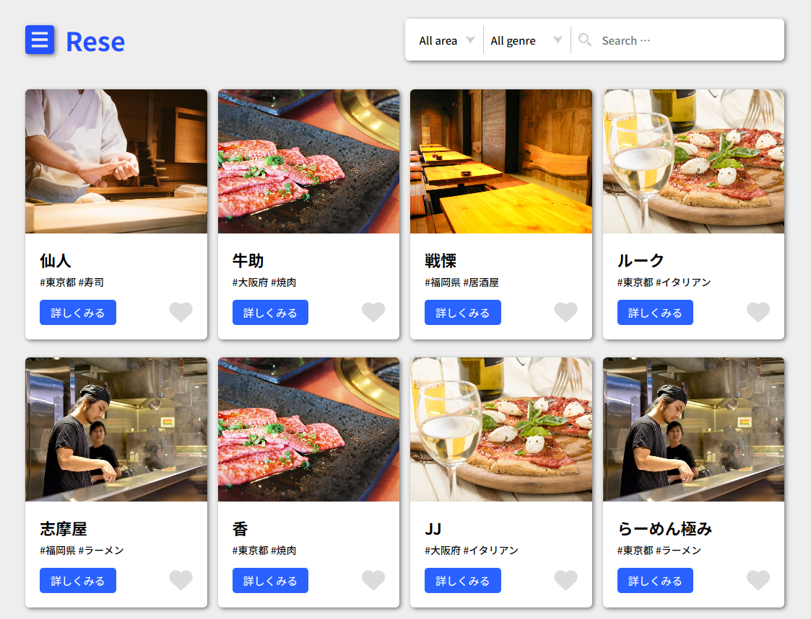
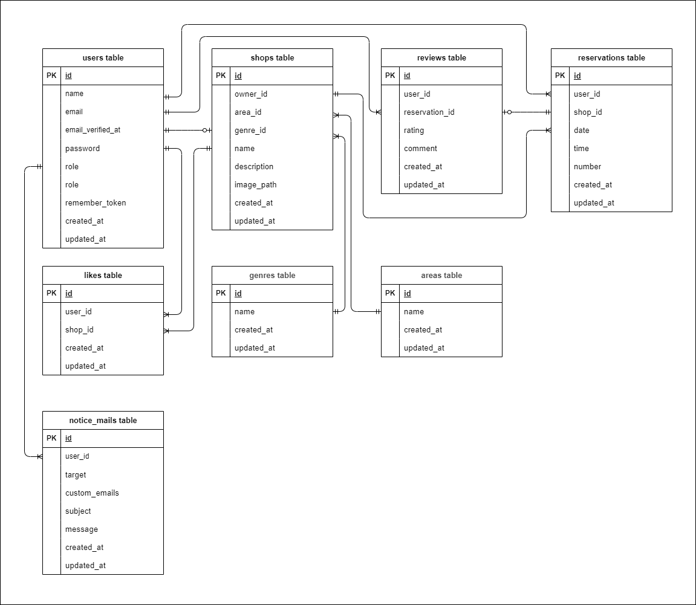

# Rese（リーズ）  

## 概要説明  
Reseは、飲食店の検索・予約・レビューができるWebアプリケーションです。  
ユーザーは飲食店を検索し、予約し、来店後にレビューを投稿できます。  
店舗代表者は予約管理・ユーザーへのお知らせメール送信も行えます。  
管理者はすべての情報を統括的に管理できます。  


## 作成の目的  
既存の飲食店予約サービスは手数料が高く、自社グループの店舗向けに手数料のかからない予約管理システムを構築したいという背景から、本アプリを開発しました。  
初年度ユーザー数10,000人を目指し、シンプルで使いやすい予約体験を提供することを目的としています。

## アプリケーションURL

- **本番環境（AWS）URL**  
  ※構築中。完成次第、以下に記載予定。  
  `https://rese.example.com`（仮）

- **開発環境（ローカル）URL**  
  [http://localhost/](http://localhost/)

## 他のリポジトリ  
※今回はフロントエンド・バックエンド統合型なので1つのみなります。  
- GitHub: https://github.com/mmisa33/rese-reservation-app

## 機能一覧

### 一般ユーザー向け機能
- 会員登録・ログイン（メール認証あり）
- ログアウト
- ユーザー情報取得
- お気に入り飲食店一覧取得・管理
- 飲食店一覧・詳細の閲覧
- 飲食店予約の追加・キャンセル
- 予約変更（日時・人数をマイページから変更可能）
- 予約済み店舗への評価（5段階評価＋コメント）
- エリア・ジャンル・店名による検索
- QRコード表示（来店時に店舗側に提示）
- Stripe決済（事前決済・前払い）

### 店舗代表者向け機能
- ログイン・ログアウト
- 管理画面アクセス
- 自店舗情報の作成・編集
- 予約情報の一覧確認
- 来店時のQRコード照合
- お知らせメール送信

### 管理者向け機能
- ログイン・ログアウト
- 管理画面アクセス
- 店舗代表者アカウントの作成・管理
- お知らせメール送信

### 共通・全体機能
- バリデーション（FormRequestによる入力チェック）
- レスポンシブデザイン（768px-850pxブレイクポイント対応）
- 画像ストレージ対応（AWS S3利用）
- メール認証機能
- リマインダー通知（予約当日の朝にタスクスケジューラーで送信）
- 環境の切り分け（開発環境・本番環境の分離）
- AWSインフラ（S3・EC2・RDS利用）

## 使用技術（実行環境）  
- **言語／フレームワーク**: PHP 8.4.4 / Laravel 8.83.8
- **データベース**: MariaDB 10.3.39 (MySQL互換)
- **インフラ**: AWS（EC2, RDS, S3）
- **開発環境構築**: Docker
- **バージョン管理**: GitHub
- **その他技術**:
  - Laravel Fortify（認証）
  - Stripe（予約時の決済）
  - MailHog（開発用メールテスト）
  - QrCode（予約確認用QRコード）

## テーブル設計

## ER図



## 環境構築

### **Dockerビルド**

1. リポジトリをクローン
   ```bash
   git clone git@github.com:mmisa33/rese-reservation-app.git
2. プロジェクトフォルダに移動
    ```bash
    cd rese
3. Dockerコンテナをビルドして起動
    ```bash
    docker-compose up -d --build
> **⚠ 注意**  
> MySQLはOSによって起動しない場合があるので、それぞれのPCに合わせて `docker-compose.yml` ファイルを編集してください。

### **Laravel環境構築**

1. PHPコンテナに入る
   ```bash
    docker-compose exec php bash
2. 必要な依存関係をインストール
    ```bash
    composer install
3. .env.example ファイルから .env を作成
    ```bash
    cp .env.example .env
4. .env ファイルの環境変数を変更  
    以下は開発環境例です。必要に応じて変更してください。
    ```bash
    # データベース設定
    DB_CONNECTION=mysql
    DB_HOST=mysql
    DB_PORT=3306
    DB_DATABASE=laravel_db
    DB_USERNAME=laravel_user
    DB_PASSWORD=laravel_pass

    # MailHog設定（開発用メール確認ツール）
    MAIL_MAILER=smtp
    MAIL_HOST=mailhog
    MAIL_PORT=1025
    MAIL_USERNAME=null
    MAIL_PASSWORD=null
    MAIL_ENCRYPTION=null
    MAIL_FROM_ADDRESS=no-reply@rese-app.local
    MAIL_FROM_NAME="Rese"
5. アプリケーションキーを生成
   ```bash
   php artisan key:generate
6. データベースをマイグレーション
   ```bash
   php artisan migrate
7. データベースに初期データを挿入
   ```bash
   php artisan db:seed
   ```
    > **💡 補足**
    > - `AdminSeeder`、`AreasTableSeeder`、`GenresTableSeeder` はアプリの動作に必須のデータを挿入します。**必ず実行してください。**  
    > - その他のシーダー（ユーザーや店舗など）は開発・テスト用のサンプルデータを挿入する目的です。  
    > - **本番環境では**、`AdminSeeder`、`AreasTableSeeder`、`GenresTableSeeder` のみを使用し、それ以外のサンプルデータは使わない想定です。

### **その他**

- Dockerコンテナの停止
    ```bash
    docker-compose down
    ```

- MailHog（メール受信確認ツール）
    [http://localhost:8025](http://localhost:8025)

- phpMyAdmin（DB操作用GUI）
    [http://localhost:8080](http://localhost:8080)

## サンプルアカウント（ログイン用）

本アプリには、`UserSeeder`にメール認証済みの一般ユーザー3名、`AdminSeeder`に管理者1名、`OwnerSeeder`に店舗代表者●名が登録されています。   
開発時や動作確認にご利用ください。

- ユーザー用ログインURL：[http://localhost/login](http://localhost/login)  
- 管理者用ログインURL：[http://localhost/admin/login](http://localhost/admin/login)
- 店舗代表者用ログインURL：[http://localhost/owner/login](http://localhost/owner/login)  


### 🔐 サンプルユーザー情報

- **田中 太郎**  
  - Email: `tanaka@example.com`  
  - Password: `password123`

- **山田 花子**  
  - Email: `yamada@example.com`  
  - Password: `password123`

- **佐藤 次郎**  
  - Email: `sato@example.com`  
  - Password: `password123`

### 🔐 サンプル店舗代表者情報

- **店舗代表者1**  
  - Email: `owner1@example.com`  
  - Password: `password123`

- **店舗代表者2**  
  - Email: `owner2@example.com`  
  - Password: `password123`

<!-- 店舗代表者はShopテーブルの件数分作成されます -->

### 🔐 サンプル管理者情報

- **管理者**  
  - Email: `admin@example.com`  
  - Password: `password123`